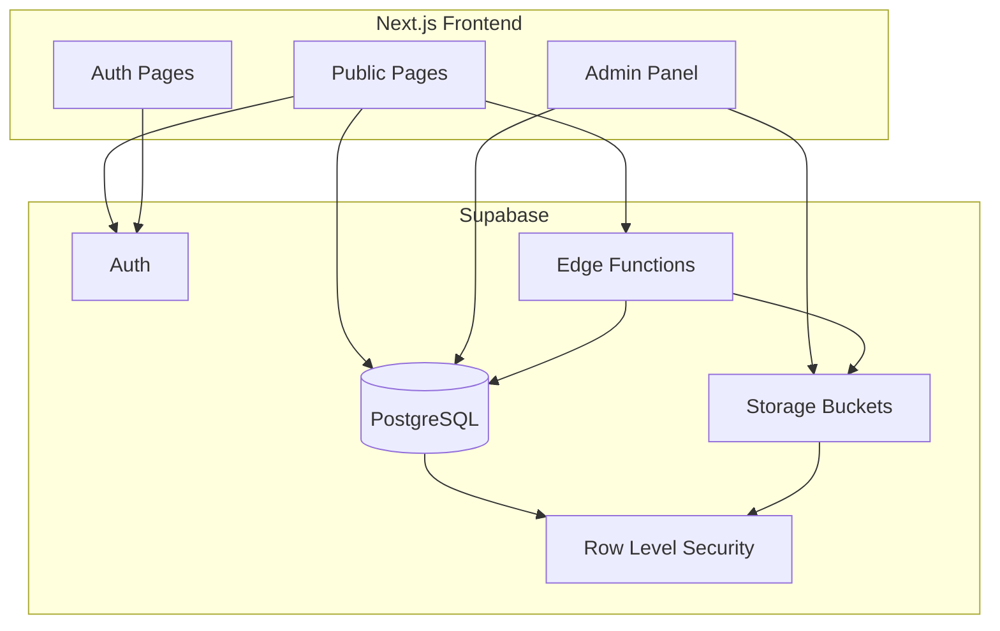
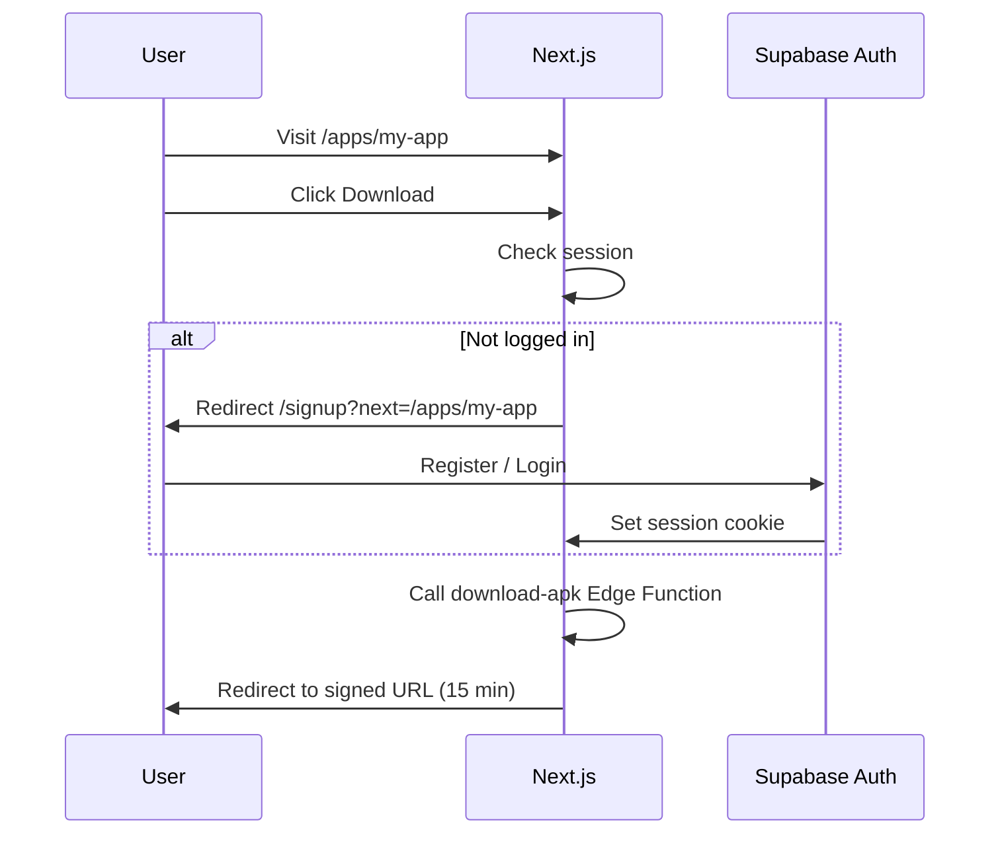

# 02 — Architecture & Tech Stack

## Stack overview

| Layer | Technology | Why |
|-------|------------|-----|
| Framework | **Next.js 15** (App Router) | SSR/SSG for SEO, API routes, middleware |
| Language | **TypeScript** | Type safety with Supabase generated types |
| Styling | **Tailwind CSS v4** | Utility-first, fast iteration |
| UI components | **shadcn/ui** | Accessible base; customize for cyber theme |
| Animation | **Framer Motion** + **GSAP ScrollTrigger** | Section heading animations, page transitions |
| Mouse FX | **Custom canvas/WebGL** or **react-cursor-follow** | Cyber glow cursor |
| Backend | **Supabase** | Auth, Postgres, Storage, Edge Functions |
| Forms | **React Hook Form** + **Zod** | Contact + admin forms |
| Deployment | **Vercel** | Next.js native hosting |
| Analytics (optional) | Vercel Analytics or Plausible | Privacy-friendly |

---

## High-level architecture



---

## Repository structure (target)

```
denstore/
├── doc/                          # This documentation
├── public/
│   ├── fonts/                    # Orbitron, Rajdhani, JetBrains Mono
│   └── og/                       # Open Graph images
├── src/
│   ├── app/
│   │   ├── (public)/             # Marketing layout
│   │   │   ├── page.tsx          # Home (5 sections)
│   │   │   ├── about/
│   │   │   ├── projects/
│   │   │   │   ├── page.tsx      # Hub (5 sections)
│   │   │   │   └── [slug]/page.tsx
│   │   │   ├── services/
│   │   │   │   ├── page.tsx      # Hub (5 sections)
│   │   │   │   └── [slug]/page.tsx
│   │   │   ├── categories/
│   │   │   │   ├── page.tsx      # Hub (5 sections)
│   │   │   │   └── [slug]/page.tsx
│   │   │   ├── apps/
│   │   │   │   ├── page.tsx      # Custom layout
│   │   │   │   └── [slug]/page.tsx
│   │   │   └── contact/page.tsx  # Flexible sections
│   │   ├── (auth)/
│   │   │   ├── login/
│   │   │   └── signup/
│   │   ├── admin/                # Protected admin routes
│   │   │   ├── layout.tsx
│   │   │   ├── page.tsx
│   │   │   ├── projects/
│   │   │   ├── services/
│   │   │   ├── categories/
│   │   │   └── apps/
│   │   └── api/                  # Optional server routes
│   ├── components/
│   │   ├── layout/               # Header, Footer, Nav
│   │   ├── sections/             # Reusable 5-section blocks
│   │   ├── animations/           # Heading anim variants, mouse cursor
│   │   ├── cards/                # Project, Service, App, Category cards
│   │   └── admin/                # Admin forms & tables
│   ├── lib/
│   │   ├── supabase/
│   │   │   ├── client.ts         # Browser client
│   │   │   ├── server.ts         # Server client
│   │   │   └── middleware.ts
│   │   └── utils.ts
│   ├── hooks/
│   ├── types/
│   │   └── database.types.ts     # Generated via MCP
│   └── styles/
│       └── globals.css
├── supabase/
│   └── functions/
│       └── download-apk/         # Edge function source (mirror for MCP deploy)
├── .env.local                    # Never commit
├── middleware.ts                 # Auth + admin guard
└── next.config.ts
```

---

## Environment variables

```env
# Public (client-safe)
NEXT_PUBLIC_SUPABASE_URL=https://aztmrbygerrqkragsncz.supabase.co
NEXT_PUBLIC_SUPABASE_PUBLISHABLE_KEY=<from get_publishable_keys MCP>
NEXT_PUBLIC_SITE_URL=https://quorestack.dev
NEXT_PUBLIC_BRAND_NAME=QuoreStack

# Server-only (never expose to client)
SUPABASE_SERVICE_ROLE_KEY=<Supabase dashboard — admin/server only>
ADMIN_EMAIL=your-email@domain.com
```

**Get publishable key via MCP:**
```
Tool: get_publishable_keys (project-0-denstore-supabase)
```

---

## Auth flow



---

## Middleware responsibilities

1. Refresh Supabase session on each request
2. Protect `/admin/*` — require `profiles.role = 'admin'`
3. Optional: protect `/api/admin/*`

---

## Data fetching strategy

| Page type | Strategy |
|-----------|----------|
| Hub pages | Server Component + Supabase server client |
| Detail pages | `generateStaticParams` for slugs + ISR/revalidate 60s |
| Admin | Client components with realtime optional |
| Contact form | Server Action or Edge Function |

---

## Performance targets

- Lighthouse Performance: ≥ 90
- LCP: < 2.5s
- Lazy-load heavy animation libs on client only
- Use `next/image` for all CMS images
- APK downloads never proxied through Next.js — signed URL only
