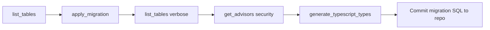

# 05 — Supabase MCP Playbook

> **Server:** `project-0-denstore-supabase`  
> **Project URL:** `https://aztmrbygerrqkragsncz.supabase.co`  
> **Config:** `.cursor/mcp.json`

Use MCP tools for **all** Supabase operations during development. Do not manually run DDL in the SQL editor without mirroring it as a migration.

---

## MCP tool reference

| Tool | When to use |
|------|-------------|
| `list_tables` | Before/after schema changes — verify structure |
| `list_migrations` | Check migration history |
| `apply_migration` | **All DDL** (CREATE TABLE, RLS, functions, triggers) |
| `execute_sql` | Seed data, one-off queries, debugging (not DDL) |
| `generate_typescript_types` | After migrations — update `database.types.ts` |
| `get_advisors` | After migrations — security & performance audit |
| `get_project_url` | Env setup |
| `get_publishable_keys` | Env setup for client |
| `deploy_edge_function` | APK download signer, contact webhook |
| `list_edge_functions` | Verify deployed functions |
| `get_edge_function` | Inspect function source |
| `get_logs` | Debug auth/storage/edge errors |
| `search_docs` | Look up Supabase patterns |
| `create_branch` / `merge_branch` | Optional: test migrations on branch first |

---

## Standard workflow (every schema change)



---

## Phase 0: Project verification

### Step 0.1 — Confirm connection
```
MCP: get_project_url
Expected: https://aztmrbygerrqkragsncz.supabase.co
```

### Step 0.2 — Get API keys
```
MCP: get_publishable_keys
→ Copy publishable key to NEXT_PUBLIC_SUPABASE_PUBLISHABLE_KEY
→ Copy service role from Supabase Dashboard (not via MCP) for server admin ops
```

### Step 0.3 — Baseline state
```
MCP: list_tables { verbose: true }
MCP: list_migrations
MCP: list_edge_functions
```
Document results — should be empty for greenfield project.

---

## Phase 1: Core schema migration

### Step 1.1 — Apply initial migration
```
MCP: apply_migration
name: initial_schema
query: <full SQL from doc/06-database-schema-and-migrations.md — Migration 001>
```

### Step 1.2 — Verify tables
```
MCP: list_tables { verbose: true }
Expected tables:
- profiles
- categories
- services
- projects
- mobile_apps
- app_versions
- project_categories (junction)
- service_categories (junction)
- contact_submissions
- downloads
- site_settings
```

### Step 1.3 — Security audit
```
MCP: get_advisors { type: "security" }
MCP: get_advisors { type: "performance" }
```
Fix any missing RLS issues before proceeding.

### Step 1.4 — Generate TypeScript types
```
MCP: generate_typescript_types
→ Save output to src/types/database.types.ts
```

---

## Phase 2: Storage buckets

Storage buckets are created via migration SQL (see Migration 002 in doc 06).

### Step 2.1 — Apply storage migration
```
MCP: apply_migration
name: storage_buckets_and_policies
query: <Migration 002 SQL>
```

### Step 2.2 — Verify via SQL
```
MCP: execute_sql
query: SELECT id, name, public FROM storage.buckets;
```

Expected buckets:
| Bucket | Public | Purpose |
|--------|--------|---------|
| `avatars` | true | Profile images |
| `project-images` | true | Web project screenshots |
| `app-assets` | true | Icons, app screenshots |
| `apks` | **false** | APK files (private) |

### Step 2.3 — Re-run advisors
```
MCP: get_advisors { type: "security" }
```

---

## Phase 3: Admin seed & profile setup

### Step 3.1 — Create your admin user
1. Sign up via the app (or Supabase Auth dashboard)
2. Note the user's UUID from Auth dashboard

### Step 3.2 — Promote to admin
```
MCP: execute_sql
query:
  UPDATE public.profiles
  SET role = 'admin'
  WHERE id = '<your-auth-user-uuid>';
```

### Step 3.3 — Seed sample content (optional)
```
MCP: execute_sql
query: <seed SQL from doc 06 — Seed section>
```

---

## Phase 4: Edge Functions

### Step 4.1 — Deploy `download-apk` function
```
MCP: deploy_edge_function
name: download-apk
verify_jwt: true
entrypoint_path: index.ts
files: [
  { name: "index.ts", content: "<function source from doc 06>" }
]
```

**Function responsibilities:**
1. Validate JWT (authenticated user)
2. Accept `{ app_id }` or `{ slug }` in POST body
3. Look up latest APK path from `app_versions`
4. Create signed URL (15 min expiry) via service role
5. Insert row into `downloads` table
6. Return `{ signedUrl, expiresIn }`

### Step 4.2 — Verify deployment
```
MCP: list_edge_functions
MCP: get_edge_function { name: "download-apk" }
```

### Step 4.3 — Test with logs
After test download from app:
```
MCP: get_logs { service: "edge-function" }
MCP: get_logs { service: "storage" }
MCP: get_logs { service: "auth" }
```

---

## Phase 5: Ongoing development

### Adding a new column
```
1. apply_migration { name: "add_field_to_projects", query: "ALTER TABLE..." }
2. list_tables { verbose: true }
3. generate_typescript_types
4. get_advisors { type: "security" }
```

### Debugging auth issues
```
MCP: get_logs { service: "auth" }
MCP: search_docs { graphql_query: "{ searchDocs(query: \"nextjs auth middleware\", limit: 3) { nodes { title href content } } }" }
```

### Debugging RLS denials
```
MCP: execute_sql
query: SELECT * FROM pg_policies WHERE tablename = 'projects';
```

---

## Phase 6: Pre-production checklist (MCP)

Run this sequence before launch:

```
□ list_migrations          — all migrations applied
□ list_tables verbose      — schema matches doc 06
□ get_advisors security    — zero critical issues
□ get_advisors performance — review indexes
□ list_edge_functions      — download-apk deployed, verify_jwt: true
□ generate_typescript_types — types in sync
□ get_logs (each service)  — no recurring errors
```

---

## Optional: Development branch workflow

For risky migrations, use a branch:

```
1. create_branch { name: "dev-schema-v2" }
2. apply_migration on branch
3. Test app against branch URL
4. merge_branch when stable
```

```
MCP: list_branches
MCP: merge_branch
MCP: delete_branch (after merge)
```

---

## search_docs examples

```
MCP: search_docs
graphql_query: "{ searchDocs(query: \"row level security policies\", limit: 5) { nodes { title href content } } }"
```

```
MCP: search_docs
graphql_query: "{ searchDocs(query: \"nextjs server component supabase\", limit: 5) { nodes { title href content } } }"
```

---

## Error recovery

| Problem | MCP action |
|---------|------------|
| Migration failed | Read error, fix SQL, apply new migration (don't edit old) |
| RLS blocking reads | `get_advisors` + review policies in doc 06 |
| Upload fails | `get_logs` service `storage`, check bucket policies |
| Download 401 | `get_logs` service `edge-function`, verify JWT |
| Type mismatch | `generate_typescript_types` and diff |

---

## Important rules

1. **Never** put service role key in client code
2. **Always** use `apply_migration` for DDL
3. **Always** run `get_advisors` after RLS changes
4. **Always** regenerate types after schema changes
5. APK bucket stays **private** — only Edge Function creates signed URLs
6. Store migration SQL in repo under `supabase/migrations/` for version control (copy from MCP)
