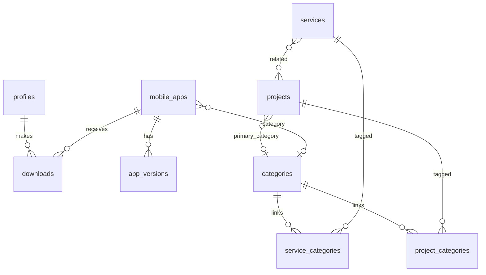

# 06 — Database Schema & Migrations

All migrations below are applied via MCP:

```
MCP: apply_migration
server: project-0-denstore-supabase
```

Copy each migration to `supabase/migrations/<timestamp>_<name>.sql` in the repo for version control.

---

## Entity relationship diagram



---

## Migration 001: `initial_schema`

```sql
-- Enable UUID extension
CREATE EXTENSION IF NOT EXISTS "uuid-ossp";

-- Custom types
CREATE TYPE user_role AS ENUM ('user', 'admin');
CREATE TYPE content_status AS ENUM ('draft', 'published', 'archived');

-- ============================================
-- PROFILES (extends auth.users)
-- ============================================
CREATE TABLE public.profiles (
  id UUID PRIMARY KEY REFERENCES auth.users(id) ON DELETE CASCADE,
  email TEXT NOT NULL,
  full_name TEXT,
  avatar_url TEXT,
  role user_role NOT NULL DEFAULT 'user',
  created_at TIMESTAMPTZ NOT NULL DEFAULT now(),
  updated_at TIMESTAMPTZ NOT NULL DEFAULT now()
);

-- Auto-create profile on signup
CREATE OR REPLACE FUNCTION public.handle_new_user()
RETURNS TRIGGER AS $$
BEGIN
  INSERT INTO public.profiles (id, email, full_name)
  VALUES (
    NEW.id,
    NEW.email,
    COALESCE(NEW.raw_user_meta_data->>'full_name', '')
  );
  RETURN NEW;
END;
$$ LANGUAGE plpgsql SECURITY DEFINER;

CREATE TRIGGER on_auth_user_created
  AFTER INSERT ON auth.users
  FOR EACH ROW EXECUTE FUNCTION public.handle_new_user();

-- ============================================
-- CATEGORIES
-- ============================================
CREATE TABLE public.categories (
  id UUID PRIMARY KEY DEFAULT uuid_generate_v4(),
  slug TEXT NOT NULL UNIQUE,
  name TEXT NOT NULL,
  short_description TEXT,
  long_description TEXT,
  icon TEXT,
  cover_image_url TEXT,
  color TEXT DEFAULT '#00f0ff',
  sort_order INT NOT NULL DEFAULT 0,
  status content_status NOT NULL DEFAULT 'draft',
  featured BOOLEAN NOT NULL DEFAULT false,
  meta_title TEXT,
  meta_description TEXT,
  created_at TIMESTAMPTZ NOT NULL DEFAULT now(),
  updated_at TIMESTAMPTZ NOT NULL DEFAULT now()
);

-- ============================================
-- SERVICES
-- ============================================
CREATE TABLE public.services (
  id UUID PRIMARY KEY DEFAULT uuid_generate_v4(),
  slug TEXT NOT NULL UNIQUE,
  name TEXT NOT NULL,
  short_description TEXT,
  long_description TEXT,
  icon TEXT,
  cover_image_url TEXT,
  deliverables JSONB DEFAULT '[]'::jsonb,
  technologies TEXT[] DEFAULT '{}',
  pricing_note TEXT,
  sort_order INT NOT NULL DEFAULT 0,
  status content_status NOT NULL DEFAULT 'draft',
  featured BOOLEAN NOT NULL DEFAULT false,
  meta_title TEXT,
  meta_description TEXT,
  created_at TIMESTAMPTZ NOT NULL DEFAULT now(),
  updated_at TIMESTAMPTZ NOT NULL DEFAULT now()
);

-- ============================================
-- PROJECTS (web projects)
-- ============================================
CREATE TABLE public.projects (
  id UUID PRIMARY KEY DEFAULT uuid_generate_v4(),
  slug TEXT NOT NULL UNIQUE,
  title TEXT NOT NULL,
  short_description TEXT,
  long_description TEXT,
  client_type TEXT,
  role TEXT,
  duration TEXT,
  year INT,
  live_url TEXT,
  github_url TEXT,
  thumbnail_url TEXT,
  gallery_urls TEXT[] DEFAULT '{}',
  tech_stack TEXT[] DEFAULT '{}',
  results JSONB DEFAULT '[]'::jsonb,
  primary_category_id UUID REFERENCES public.categories(id) ON DELETE SET NULL,
  sort_order INT NOT NULL DEFAULT 0,
  status content_status NOT NULL DEFAULT 'draft',
  featured BOOLEAN NOT NULL DEFAULT false,
  meta_title TEXT,
  meta_description TEXT,
  created_at TIMESTAMPTZ NOT NULL DEFAULT now(),
  updated_at TIMESTAMPTZ NOT NULL DEFAULT now()
);

-- ============================================
-- MOBILE APPS
-- ============================================
CREATE TABLE public.mobile_apps (
  id UUID PRIMARY KEY DEFAULT uuid_generate_v4(),
  slug TEXT NOT NULL UNIQUE,
  name TEXT NOT NULL,
  tagline TEXT,
  short_description TEXT,
  long_description TEXT,
  icon_url TEXT,
  screenshot_urls TEXT[] DEFAULT '{}',
  features JSONB DEFAULT '[]'::jsonb,
  tech_stack TEXT[] DEFAULT '{}',
  min_android_version TEXT DEFAULT '8.0',
  category_id UUID REFERENCES public.categories(id) ON DELETE SET NULL,
  sort_order INT NOT NULL DEFAULT 0,
  status content_status NOT NULL DEFAULT 'draft',
  featured BOOLEAN NOT NULL DEFAULT false,
  meta_title TEXT,
  meta_description TEXT,
  created_at TIMESTAMPTZ NOT NULL DEFAULT now(),
  updated_at TIMESTAMPTZ NOT NULL DEFAULT now()
);

-- ============================================
-- APP VERSIONS (APK tracking)
-- ============================================
CREATE TABLE public.app_versions (
  id UUID PRIMARY KEY DEFAULT uuid_generate_v4(),
  app_id UUID NOT NULL REFERENCES public.mobile_apps(id) ON DELETE CASCADE,
  version TEXT NOT NULL,
  version_code INT,
  apk_path TEXT NOT NULL,
  file_size_bytes BIGINT,
  changelog TEXT,
  is_latest BOOLEAN NOT NULL DEFAULT false,
  created_at TIMESTAMPTZ NOT NULL DEFAULT now(),
  UNIQUE(app_id, version)
);

-- Ensure only one latest version per app
CREATE OR REPLACE FUNCTION public.ensure_single_latest_version()
RETURNS TRIGGER AS $$
BEGIN
  IF NEW.is_latest = true THEN
    UPDATE public.app_versions
    SET is_latest = false
    WHERE app_id = NEW.app_id AND id != NEW.id;
  END IF;
  RETURN NEW;
END;
$$ LANGUAGE plpgsql;

CREATE TRIGGER trg_single_latest_version
  BEFORE INSERT OR UPDATE ON public.app_versions
  FOR EACH ROW EXECUTE FUNCTION public.ensure_single_latest_version();

-- ============================================
-- JUNCTION TABLES
-- ============================================
CREATE TABLE public.project_categories (
  project_id UUID NOT NULL REFERENCES public.projects(id) ON DELETE CASCADE,
  category_id UUID NOT NULL REFERENCES public.categories(id) ON DELETE CASCADE,
  PRIMARY KEY (project_id, category_id)
);

CREATE TABLE public.service_categories (
  service_id UUID NOT NULL REFERENCES public.services(id) ON DELETE CASCADE,
  category_id UUID NOT NULL REFERENCES public.categories(id) ON DELETE CASCADE,
  PRIMARY KEY (service_id, category_id)
);

CREATE TABLE public.project_services (
  project_id UUID NOT NULL REFERENCES public.projects(id) ON DELETE CASCADE,
  service_id UUID NOT NULL REFERENCES public.services(id) ON DELETE CASCADE,
  PRIMARY KEY (project_id, service_id)
);

-- ============================================
-- CONTACT SUBMISSIONS
-- ============================================
CREATE TABLE public.contact_submissions (
  id UUID PRIMARY KEY DEFAULT uuid_generate_v4(),
  name TEXT NOT NULL,
  email TEXT NOT NULL,
  subject TEXT,
  message TEXT NOT NULL,
  service_interest TEXT,
  is_read BOOLEAN NOT NULL DEFAULT false,
  created_at TIMESTAMPTZ NOT NULL DEFAULT now()
);

-- ============================================
-- DOWNLOAD LOG
-- ============================================
CREATE TABLE public.downloads (
  id UUID PRIMARY KEY DEFAULT uuid_generate_v4(),
  user_id UUID NOT NULL REFERENCES public.profiles(id) ON DELETE CASCADE,
  app_id UUID NOT NULL REFERENCES public.mobile_apps(id) ON DELETE CASCADE,
  version_id UUID REFERENCES public.app_versions(id) ON DELETE SET NULL,
  ip_address TEXT,
  user_agent TEXT,
  created_at TIMESTAMPTZ NOT NULL DEFAULT now()
);

-- ============================================
-- SITE SETTINGS (singleton-style)
-- ============================================
CREATE TABLE public.site_settings (
  id UUID PRIMARY KEY DEFAULT uuid_generate_v4(),
  key TEXT NOT NULL UNIQUE,
  value JSONB NOT NULL DEFAULT '{}'::jsonb,
  updated_at TIMESTAMPTZ NOT NULL DEFAULT now()
);

-- ============================================
-- UPDATED_AT TRIGGER
-- ============================================
CREATE OR REPLACE FUNCTION public.set_updated_at()
RETURNS TRIGGER AS $$
BEGIN
  NEW.updated_at = now();
  RETURN NEW;
END;
$$ LANGUAGE plpgsql;

CREATE TRIGGER set_profiles_updated_at BEFORE UPDATE ON public.profiles
  FOR EACH ROW EXECUTE FUNCTION public.set_updated_at();
CREATE TRIGGER set_categories_updated_at BEFORE UPDATE ON public.categories
  FOR EACH ROW EXECUTE FUNCTION public.set_updated_at();
CREATE TRIGGER set_services_updated_at BEFORE UPDATE ON public.services
  FOR EACH ROW EXECUTE FUNCTION public.set_updated_at();
CREATE TRIGGER set_projects_updated_at BEFORE UPDATE ON public.projects
  FOR EACH ROW EXECUTE FUNCTION public.set_updated_at();
CREATE TRIGGER set_mobile_apps_updated_at BEFORE UPDATE ON public.mobile_apps
  FOR EACH ROW EXECUTE FUNCTION public.set_updated_at();

-- ============================================
-- INDEXES
-- ============================================
CREATE INDEX idx_projects_slug ON public.projects(slug);
CREATE INDEX idx_projects_status ON public.projects(status);
CREATE INDEX idx_services_slug ON public.services(slug);
CREATE INDEX idx_categories_slug ON public.categories(slug);
CREATE INDEX idx_mobile_apps_slug ON public.mobile_apps(slug);
CREATE INDEX idx_app_versions_app_latest ON public.app_versions(app_id, is_latest);
CREATE INDEX idx_downloads_app ON public.downloads(app_id);
CREATE INDEX idx_downloads_user ON public.downloads(user_id);

-- ============================================
-- ROW LEVEL SECURITY
-- ============================================
ALTER TABLE public.profiles ENABLE ROW LEVEL SECURITY;
ALTER TABLE public.categories ENABLE ROW LEVEL SECURITY;
ALTER TABLE public.services ENABLE ROW LEVEL SECURITY;
ALTER TABLE public.projects ENABLE ROW LEVEL SECURITY;
ALTER TABLE public.mobile_apps ENABLE ROW LEVEL SECURITY;
ALTER TABLE public.app_versions ENABLE ROW LEVEL SECURITY;
ALTER TABLE public.project_categories ENABLE ROW LEVEL SECURITY;
ALTER TABLE public.service_categories ENABLE ROW LEVEL SECURITY;
ALTER TABLE public.project_services ENABLE ROW LEVEL SECURITY;
ALTER TABLE public.contact_submissions ENABLE ROW LEVEL SECURITY;
ALTER TABLE public.downloads ENABLE ROW LEVEL SECURITY;
ALTER TABLE public.site_settings ENABLE ROW LEVEL SECURITY;

-- Helper: check if current user is admin
CREATE OR REPLACE FUNCTION public.is_admin()
RETURNS BOOLEAN AS $$
  SELECT EXISTS (
    SELECT 1 FROM public.profiles
    WHERE id = auth.uid() AND role = 'admin'
  );
$$ LANGUAGE sql SECURITY DEFINER STABLE;

-- PROFILES policies
CREATE POLICY "Public profiles readable by owner"
  ON public.profiles FOR SELECT
  USING (auth.uid() = id OR public.is_admin());

CREATE POLICY "Users update own profile"
  ON public.profiles FOR UPDATE
  USING (auth.uid() = id);

-- PUBLIC READ: published content
CREATE POLICY "Published categories are public"
  ON public.categories FOR SELECT
  USING (status = 'published' OR public.is_admin());

CREATE POLICY "Published services are public"
  ON public.services FOR SELECT
  USING (status = 'published' OR public.is_admin());

CREATE POLICY "Published projects are public"
  ON public.projects FOR SELECT
  USING (status = 'published' OR public.is_admin());

CREATE POLICY "Published apps are public"
  ON public.mobile_apps FOR SELECT
  USING (status = 'published' OR public.is_admin());

-- App versions: metadata public (not APK path for anon — hide path via view or policy)
CREATE POLICY "App version metadata public"
  ON public.app_versions FOR SELECT
  USING (
    EXISTS (
      SELECT 1 FROM public.mobile_apps ma
      WHERE ma.id = app_id AND (ma.status = 'published' OR public.is_admin())
    )
  );

-- Junction tables: public read
CREATE POLICY "project_categories public read"
  ON public.project_categories FOR SELECT USING (true);
CREATE POLICY "service_categories public read"
  ON public.service_categories FOR SELECT USING (true);
CREATE POLICY "project_services public read"
  ON public.project_services FOR SELECT USING (true);

-- ADMIN write policies (all CMS tables)
CREATE POLICY "Admin manage categories"
  ON public.categories FOR ALL
  USING (public.is_admin()) WITH CHECK (public.is_admin());

CREATE POLICY "Admin manage services"
  ON public.services FOR ALL
  USING (public.is_admin()) WITH CHECK (public.is_admin());

CREATE POLICY "Admin manage projects"
  ON public.projects FOR ALL
  USING (public.is_admin()) WITH CHECK (public.is_admin());

CREATE POLICY "Admin manage mobile_apps"
  ON public.mobile_apps FOR ALL
  USING (public.is_admin()) WITH CHECK (public.is_admin());

CREATE POLICY "Admin manage app_versions"
  ON public.app_versions FOR ALL
  USING (public.is_admin()) WITH CHECK (public.is_admin());

CREATE POLICY "Admin manage junctions"
  ON public.project_categories FOR ALL
  USING (public.is_admin()) WITH CHECK (public.is_admin());

CREATE POLICY "Admin manage service_categories"
  ON public.service_categories FOR ALL
  USING (public.is_admin()) WITH CHECK (public.is_admin());

CREATE POLICY "Admin manage project_services"
  ON public.project_services FOR ALL
  USING (public.is_admin()) WITH CHECK (public.is_admin());

-- Contact: anyone can insert, admin can read
CREATE POLICY "Anyone can submit contact"
  ON public.contact_submissions FOR INSERT
  WITH CHECK (true);

CREATE POLICY "Admin read contacts"
  ON public.contact_submissions FOR SELECT
  USING (public.is_admin());

CREATE POLICY "Admin update contacts"
  ON public.contact_submissions FOR UPDATE
  USING (public.is_admin());

-- Downloads: users see own, admin sees all; insert via service role / edge function
CREATE POLICY "Users see own downloads"
  ON public.downloads FOR SELECT
  USING (auth.uid() = user_id OR public.is_admin());

CREATE POLICY "Authenticated users can log downloads"
  ON public.downloads FOR INSERT
  WITH CHECK (auth.uid() = user_id);

-- Site settings: public read for safe keys, admin write
CREATE POLICY "Public read site settings"
  ON public.site_settings FOR SELECT
  USING (true);

CREATE POLICY "Admin manage site settings"
  ON public.site_settings FOR ALL
  USING (public.is_admin()) WITH CHECK (public.is_admin());
```

---

## Migration 002: `storage_buckets_and_policies`

```sql
-- Create buckets
INSERT INTO storage.buckets (id, name, public, file_size_limit, allowed_mime_types)
VALUES
  ('avatars', 'avatars', true, 5242880, ARRAY['image/jpeg', 'image/png', 'image/webp']),
  ('project-images', 'project-images', true, 10485760, ARRAY['image/jpeg', 'image/png', 'image/webp', 'image/gif']),
  ('app-assets', 'app-assets', true, 10485760, ARRAY['image/jpeg', 'image/png', 'image/webp']),
  ('apks', 'apks', false, 157286400, ARRAY['application/vnd.android.package-archive', 'application/octet-stream'])
ON CONFLICT (id) DO NOTHING;

-- Public read for public buckets
CREATE POLICY "Public read avatars"
  ON storage.objects FOR SELECT
  USING (bucket_id = 'avatars');

CREATE POLICY "Public read project-images"
  ON storage.objects FOR SELECT
  USING (bucket_id = 'project-images');

CREATE POLICY "Public read app-assets"
  ON storage.objects FOR SELECT
  USING (bucket_id = 'app-assets');

-- Admin upload to public buckets
CREATE POLICY "Admin upload avatars"
  ON storage.objects FOR INSERT
  WITH CHECK (bucket_id = 'avatars' AND public.is_admin());

CREATE POLICY "Admin upload project-images"
  ON storage.objects FOR INSERT
  WITH CHECK (bucket_id = 'project-images' AND public.is_admin());

CREATE POLICY "Admin upload app-assets"
  ON storage.objects FOR INSERT
  WITH CHECK (bucket_id = 'app-assets' AND public.is_admin());

CREATE POLICY "Admin update public buckets"
  ON storage.objects FOR UPDATE
  USING (bucket_id IN ('avatars', 'project-images', 'app-assets') AND public.is_admin());

CREATE POLICY "Admin delete public buckets"
  ON storage.objects FOR DELETE
  USING (bucket_id IN ('avatars', 'project-images', 'app-assets') AND public.is_admin());

-- APK bucket: admin upload only, NO public SELECT
CREATE POLICY "Admin upload apks"
  ON storage.objects FOR INSERT
  WITH CHECK (bucket_id = 'apks' AND public.is_admin());

CREATE POLICY "Admin manage apks"
  ON storage.objects FOR ALL
  USING (bucket_id = 'apks' AND public.is_admin());
```

---

## Edge Function: `download-apk`

Deploy via MCP `deploy_edge_function` with `verify_jwt: true`.

```typescript
// supabase/functions/download-apk/index.ts
import "jsr:@supabase/functions-js/edge-runtime.d.ts";
import { createClient } from "jsr:@supabase/supabase-js@2";

const corsHeaders = {
  "Access-Control-Allow-Origin": "*",
  "Access-Control-Allow-Headers": "authorization, x-client-info, apikey, content-type",
};

Deno.serve(async (req: Request) => {
  if (req.method === "OPTIONS") {
    return new Response("ok", { headers: corsHeaders });
  }

  try {
    const authHeader = req.headers.get("Authorization");
    if (!authHeader) {
      return new Response(JSON.stringify({ error: "Unauthorized" }), {
        status: 401,
        headers: { ...corsHeaders, "Content-Type": "application/json" },
      });
    }

    const supabaseUser = createClient(
      Deno.env.get("SUPABASE_URL")!,
      Deno.env.get("SUPABASE_ANON_KEY")!,
      { global: { headers: { Authorization: authHeader } } }
    );

    const { data: { user }, error: authError } = await supabaseUser.auth.getUser();
    if (authError || !user) {
      return new Response(JSON.stringify({ error: "Invalid session" }), {
        status: 401,
        headers: { ...corsHeaders, "Content-Type": "application/json" },
      });
    }

    const { slug } = await req.json();
    if (!slug) {
      return new Response(JSON.stringify({ error: "slug required" }), {
        status: 400,
        headers: { ...corsHeaders, "Content-Type": "application/json" },
      });
    }

    const supabaseAdmin = createClient(
      Deno.env.get("SUPABASE_URL")!,
      Deno.env.get("SUPABASE_SERVICE_ROLE_KEY")!
    );

    const { data: app, error: appError } = await supabaseAdmin
      .from("mobile_apps")
      .select("id, name, slug, status")
      .eq("slug", slug)
      .eq("status", "published")
      .single();

    if (appError || !app) {
      return new Response(JSON.stringify({ error: "App not found" }), {
        status: 404,
        headers: { ...corsHeaders, "Content-Type": "application/json" },
      });
    }

    const { data: version, error: versionError } = await supabaseAdmin
      .from("app_versions")
      .select("id, apk_path, version")
      .eq("app_id", app.id)
      .eq("is_latest", true)
      .single();

    if (versionError || !version) {
      return new Response(JSON.stringify({ error: "No APK available" }), {
        status: 404,
        headers: { ...corsHeaders, "Content-Type": "application/json" },
      });
    }

    const expiresIn = 900; // 15 minutes
    const { data: signed, error: signError } = await supabaseAdmin.storage
      .from("apks")
      .createSignedUrl(version.apk_path, expiresIn, {
        download: `${app.slug}-v${version.version}.apk`,
      });

    if (signError || !signed?.signedUrl) {
      return new Response(JSON.stringify({ error: "Failed to generate download URL" }), {
        status: 500,
        headers: { ...corsHeaders, "Content-Type": "application/json" },
      });
    }

    await supabaseAdmin.from("downloads").insert({
      user_id: user.id,
      app_id: app.id,
      version_id: version.id,
      user_agent: req.headers.get("user-agent"),
    });

    return new Response(
      JSON.stringify({
        signedUrl: signed.signedUrl,
        expiresIn,
        version: version.version,
      }),
      { headers: { ...corsHeaders, "Content-Type": "application/json" } }
    );
  } catch (err) {
    return new Response(JSON.stringify({ error: "Internal server error" }), {
      status: 500,
      headers: { ...corsHeaders, "Content-Type": "application/json" },
    });
  }
});
```

---

## Seed data (optional)

Run via `execute_sql` after admin account exists:

```sql
-- Categories
INSERT INTO public.categories (slug, name, short_description, long_description, status, featured, sort_order) VALUES
  ('e-commerce', 'E-Commerce', 'Online stores and marketplaces', 'Full e-commerce solutions including cart, payments, and admin dashboards.', 'published', true, 1),
  ('mobile-apps', 'Mobile Apps', 'Android applications', 'Native and cross-platform mobile applications for Android.', 'published', true, 2),
  ('saas-dashboards', 'SaaS & Dashboards', 'Web applications and admin panels', 'Scalable SaaS products and data-driven dashboards.', 'published', false, 3),
  ('apis-backend', 'APIs & Backend', 'Server-side systems', 'RESTful APIs, GraphQL, and Supabase backend architecture.', 'published', false, 4);

-- Services
INSERT INTO public.services (slug, name, short_description, long_description, deliverables, technologies, pricing_note, status, featured, sort_order) VALUES
  ('full-stack-web', 'Full Stack Web Development', 'End-to-end web applications', 'From database design to polished frontend interfaces.', '["Requirements analysis","UI implementation","API development","Deployment"]'::jsonb, ARRAY['Next.js','React','Node.js','Supabase'], 'Custom quote based on scope', 'published', true, 1),
  ('mobile-android', 'Android App Development', 'Native and cross-platform apps', 'Production-ready Android apps with clean architecture.', '["App design implementation","APK delivery","Play Store prep","Documentation"]'::jsonb, ARRAY['Kotlin','Flutter','React Native'], 'Starting from project scope review', 'published', true, 2);

-- Site settings
INSERT INTO public.site_settings (key, value) VALUES
  ('hero', '{"headline": "QuoreStack", "subheadline": "Full Stack Development by Quoreeb Adebayo", "cta_primary": "View Projects", "cta_secondary": "Explore Apps"}'::jsonb),
  ('stats', '{"years": 3, "projects": 15, "apps": 5, "technologies": 20}'::jsonb),
  ('social', '{"github": "", "linkedin": "", "twitter": "", "email": ""}'::jsonb);
```

---

## TypeScript types regeneration

After every migration:

```
MCP: generate_typescript_types
→ Save to src/types/database.types.ts
```

---

## Security notes

1. `apk_path` in `app_versions` should not be exposed to anonymous clients in UI — Edge Function handles download
2. Consider a public **view** that omits `apk_path` for client queries:

```sql
CREATE VIEW public.app_versions_public AS
SELECT id, app_id, version, version_code, file_size_bytes, changelog, is_latest, created_at
FROM public.app_versions;
```

3. Run `get_advisors { type: "security" }` after applying all migrations
